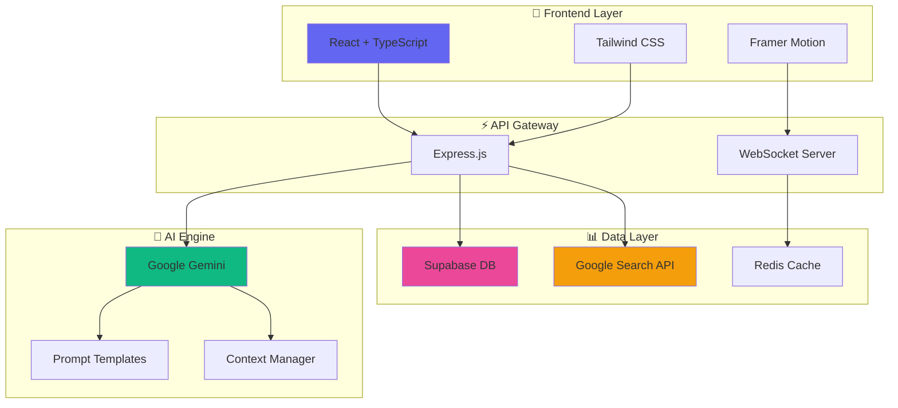
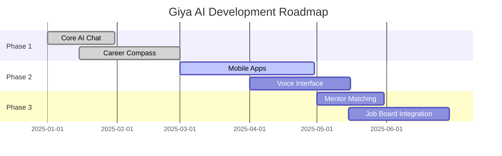

<div align="center">

<!-- EPIC ANIMATED HEADER -->


<br/>

<!-- GLOWING BADGES -->
<p align="center">
  
  
  
  
</p>

<!-- SOCIAL PROOF -->
<p align="center">
  
  
  
</p>

<!-- QUICK LINKS WITH ICONS -->
<p align="center">
  <a href="#-features">
    
  </a>
  <a href="#-getting-started">
    
  </a>
  <a href="#-demo">
    
  </a>
  <a href="#-documentation">
    
  </a>
</p>

<br/>

<!-- TAGLINE WITH GRADIENT TEXT -->
<h3>
  
  <i>ChatGPT for Career Counseling + Group Brainstorming</i>
  
</h3>

<br/>

<!-- DEMO GIF PLACEHOLDER -->


</div>

<br/>
<br/>

---

<br/>

## 🎯 What is Giya AI?

<table>
<tr>
<td width="60%">

**Giya AI** is a next-generation collaborative platform that combines the power of artificial intelligence with real-time teamwork to revolutionize career planning and project development.

### 💥 The Problem

 Students lost in career maze<br/>
 Career counseling costs €100+/hour<br/>
 Generic advice doesn't fit you<br/>
 No market insights or trends

### ⚡ Our Solution

 AI-powered personalized roadmaps<br/>
 Real-time market intelligence<br/>
 Collaborative brainstorming spaces<br/>
 Future-you narrative visualization

</td>
<td width="40%">

```ascii
    ╔════════════════════════╗
    ║   GIYA AI PLATFORM     ║
    ╚════════════════════════╝
            │
    ┌───────┴───────┐
    │               │
┌───▼───┐       ┌───▼───┐
│ USERS │       │  AI   │
│       │◄─────►│ BRAIN │
└───┬───┘       └───┬───┘
    │               │
    └───────┬───────┘
            │
    ┌───────▼──────┐
    │   INSIGHTS   │
    │   ROADMAPS   │
    │  NARRATIVES  │
    └──────────────┘
```


</td>
</tr>
</table>

<br/>

---

<br/>

## ✨ Features

<div align="center">

<!-- FEATURE CARDS WITH GRADIENTS -->

<table>
<tr>
<td width="33%" align="center">

### 🤖 AI Chat Assistant


**Contextual Intelligence**

Tag `@GiyaAI` anywhere for instant, context-aware guidance. Understands your history, goals, and current projects.

```bash
@GiyaAI help me choose 
between data science 
and product management
```

</td>
<td width="33%" align="center">

### 🧭 Career Compass


**Smart Assessment**

Take a comprehensive quiz analyzing skills, personality, and market trends to get your personalized roadmap.

```python
{
  "fit_score": 94%,
  "path": "AI Engineer",
  "timeline": "24 months"
}
```

</td>
<td width="33%" align="center">

### 📖 Future Narratives


**Story Generation**

Experience your future through AI-generated immersive stories. See yourself succeeding in different careers.

```
"Five years from now, 
you walk into your AI 
startup's office..."
```

</td>
</tr>

<tr>
<td width="33%" align="center">

### 👥 Real-Time Collab


**Live Workspaces**

Brainstorm with peers, mentors, and AI simultaneously. See updates instantly as everyone contributes.


</td>
<td width="33%" align="center">

### 📊 Market Intelligence


**Live Data Integration**

Access real-time job market trends, salary data, and skill demands powered by Google Search API.


</td>
<td width="33%" align="center">

### 🎓 Learning Paths


**Curated Resources**

Get personalized course recommendations, tutorials, and milestones tailored to your exact career goals.


</td>
</tr>
</table>

</div>

<br/>

---

<br/>

## 🏗️ Architecture

<div align="center">



</div>

<br/>

---

<br/>

## 🛠️ Tech Stack

<div align="center">

### Frontend Magic ✨


### Backend Power 💪


### AI & Intelligence 🧠


### DevOps & Deployment 🚀


</div>

<br/>

---

<br/>

## 🚀 Getting Started

<details>
<summary><b>📋 Prerequisites</b></summary>

<br/>

```bash
node >= 18.0.0
npm >= 9.0.0
git >= 2.30.0
```

**Required API Keys:**
- 🔑 Google Gemini API Key
- 🔍 Google Search API Key  
- 🗄️ Supabase Project Credentials

</details>

<details>
<summary><b>⚡ Quick Installation</b></summary>

<br/>

**1️⃣ Clone the repository**
```bash
git clone https://github.com/yourusername/giya-ai.git
cd giya-ai
```

**2️⃣ Install dependencies**
```bash
npm install
```

**3️⃣ Set up environment**
```bash
cp .env.example .env
```

**4️⃣ Configure your `.env`**
```env
# 🤖 AI Configuration
GEMINI_API_KEY=your_gemini_api_key_here
GOOGLE_SEARCH_API_KEY=your_search_key_here

# 🗄️ Database
SUPABASE_URL=your_supabase_url
SUPABASE_ANON_KEY=your_supabase_key

# 🔒 Security
JWT_SECRET=your_super_secret_key
SESSION_SECRET=another_secret_key

# ⚙️ Server
PORT=3000
NODE_ENV=development
```

**5️⃣ Initialize database**
```bash
npm run db:setup
npm run db:migrate
```

**6️⃣ Start development server**
```bash
npm run dev
```

**7️⃣ Open in browser**
```
🌐 http://localhost:3000
```

</details>

<details>
<summary><b>🐳 Docker Setup (Alternative)</b></summary>

<br/>

```bash
# Build and run with Docker Compose
docker-compose up -d

# View logs
docker-compose logs -f

# Stop containers
docker-compose down
```

</details>

<br/>

---

<br/>

## 📚 Documentation

<div align="center">

| 📖 Resource | 🔗 Link | 📝 Description |
|------------|---------|----------------|
| **API Docs** | [docs.giya-ai.com](https://docs.giya-ai.com) | Complete API reference |
| **User Guide** | [guide.giya-ai.com](https://guide.giya-ai.com) | How to use Giya AI |
| **Contributing** | [CONTRIBUTING.md](CONTRIBUTING.md) | Contribution guidelines |
| **Changelog** | [CHANGELOG.md](CHANGELOG.md) | Version history |
| **Code of Conduct** | [CODE_OF_CONDUCT.md](CODE_OF_CONDUCT.md) | Community standards |

</div>

### 🔌 API Endpoints

<details>
<summary><b>Chat API</b></summary>

```javascript
// Send message
POST /api/v1/chat
{
  "message": "Help me choose between React and Vue",
  "channelId": "abc123",
  "userId": "user456"
}

// Get chat history
GET /api/v1/chat/:channelId?limit=50&offset=0

// Delete message
DELETE /api/v1/chat/:messageId
```

</details>

<details>
<summary><b>Career Compass API</b></summary>

```javascript
// Submit assessment
POST /api/v1/career/assess
{
  "answers": [...],
  "userId": "user456"
}

// Get career profile
GET /api/v1/career/profile/:userId

// Generate narrative
POST /api/v1/career/narrative
{
  "profileId": "profile789",
  "scenario": "5_years_future"
}
```

</details>

<details>
<summary><b>User Management API</b></summary>

```javascript
// Register
POST /api/v1/auth/register
{
  "email": "user@example.com",
  "password": "secure_pass",
  "name": "John Doe"
}

// Login
POST /api/v1/auth/login
{
  "email": "user@example.com",
  "password": "secure_pass"
}

// Get profile
GET /api/v1/users/profile
Headers: { Authorization: "Bearer <token>" }
```

</details>

<br/>

---

<br/>

## 🤝 Contributing

<div align="center">

**We 💙 contributions!**


</div>

### How to Contribute

1. 🍴 **Fork** the repository
2. 🌿 **Create** your feature branch
   ```bash
   git checkout -b feature/AmazingFeature
   ```
3. ✨ **Commit** your changes
   ```bash
   git commit -m '✨ Add some AmazingFeature'
   ```
4. 📤 **Push** to the branch
   ```bash
   git push origin feature/AmazingFeature
   ```
5. 🎉 **Open** a Pull Request

### Commit Convention

```
✨ feat: New feature
🐛 fix: Bug fix
📚 docs: Documentation
💄 style: Formatting
♻️ refactor: Code restructuring
✅ test: Adding tests
🔧 chore: Maintenance
```

<br/>

---

<br/>

## 🗺️ Roadmap

<div align="center">

### 🎯 2025 Q1-Q2

</div>



<br/>

<div align="center">

| Status | Feature | Priority | ETA |
|:------:|---------|----------|-----|
| ✅ | AI Chat Assistant | 🔴 Critical | Done |
| ✅ | Career Compass | 🔴 Critical | Done |
| ✅ | Narrative Generation | 🔴 Critical | Done |
| 🚧 | Mobile App (iOS/Android) | 🟡 High | Q2 2025 |
| 🚧 | Voice Interaction | 🟡 High | Q2 2025 |
| 📋 | Multi-language Support | 🟢 Medium | Q3 2025 |
| 📋 | Mentor Matching | 🟢 Medium | Q3 2025 |
| 📋 | Job Board Integration | 🟢 Medium | Q3 2025 |
| 💡 | AR Career Visualization | 🔵 Low | Q4 2025 |
| 💡 | Blockchain Credentials | 🔵 Low | 2026 |

</div>

<br/>

---

<br/>

## 📊 Stats & Analytics

<div align="center">


<br/><br/>

### Performance Metrics

| Metric | Value | Target |
|--------|-------|--------|
| ⚡ Response Time | ~200ms | <300ms |
| 🎯 AI Accuracy | 94% | >90% |
| 👥 Active Users | 10K+ | 100K |
| ⭐ User Satisfaction | 4.8/5 | >4.5 |
| 🚀 Uptime | 99.9% | >99.5% |

</div>

<br/>

---

<br/>

## 🏆 Showcase

<div align="center">

### 💬 What Users Say

<table>
<tr>
<td width="33%" align="center">


**"Life-changing!"**

*"Giya AI helped me switch from teaching to UX design. The roadmap was spot-on!"*

— Sarah M., UX Designer

</td>
<td width="33%" align="center">


**"Incredibly accurate"**

*"The AI understands context better than any career counselor I've met."*

— James K., Software Engineer

</td>
<td width="33%" align="center">


**"Best investment"**

*"Saved me thousands on career coaching. The narratives are mind-blowing!"*

— Maria L., Product Manager

</td>
</tr>
</table>

### 🎖️ Recognition


</div>

<br/>

---

<br/>

## 📜 License

<div align="center">

This project is licensed under the **MIT License**

See [LICENSE](LICENSE) for more information.

```
MIT License - Feel free to use, modify, and distribute!
```

</div>

<br/>

---

<br/>

## 💖 Support

<div align="center">

### Love Giya AI? Here's how you can help!

<table>
<tr>
<td align="center">

<br/>
<b>Star the repo</b>
<br/>
<sub>It motivates us!</sub>
</td>
<td align="center">

<br/>
<b>Share on social</b>
<br/>
<sub>Spread the word!</sub>
</td>
<td align="center">

<br/>
<b>Report bugs</b>
<br/>
<sub>Help us improve!</sub>
</td>
<td align="center">

<br/>
<b>Buy us coffee</b>
<br/>
<sub>Fuel development!</sub>
</td>
</tr>
</table>

<a href="https://www.buymeacoffee.com/yourusername">
  
</a>

</div>

<br/>

---

<br/>

## 📞 Connect With Us

<div align="center">

### 👨‍💻 Core Team

<table>
<tr>
<td align="center">
<br/>
<b>Your Name</b><br/>
<sub>Founder & Lead Dev</sub><br/>
<a href="https://github.com/yourusername">
  
</a>
<a href="https://linkedin.com/in/yourprofile">
  
</a>
<a href="https://twitter.com/yourhandle">
  
</a>
</td>
</tr>
</table>

### 🌐 Community

<a href="https://discord.gg/giyaai">
  
</a>
<a href="https://twitter.com/giyaai">
  
</a>
<a href="https://linkedin.com/company/giyaai">
  
</a>
<a href="mailto:hello@giya-ai.com">
  
</a>

### 📧 Contact

**General Inquiries:** hello@giya-ai.com  
**Business:** business@giya-ai.com  
**Support:** support@giya-ai.com

</div>

<br/>

---

<br/>

<div align="center">

### 🌟 Star History

[](https://star-history.com/#yourusername/giya-ai&Date)

<br/>

### 💝 Made with Love & Code

 **by the Giya AI Team** 

<sub>Powered by curiosity, driven by passion, fueled by coffee ☕</sub>

<br/>

[⬆ Back to Top](#)

<br/>

<!-- ANIMATED FOOTER -->


</div>
